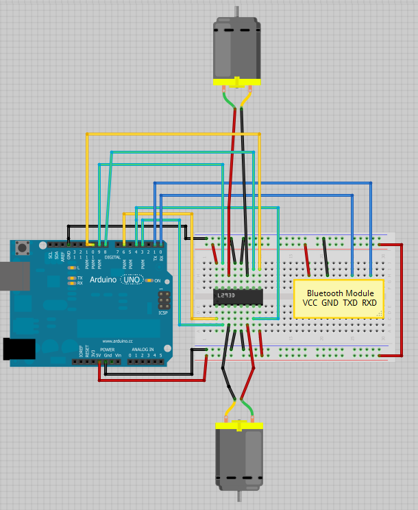

# Contrôle des Moteurs avec Arduino, L293D et Bluetooth

Ce projet permet de contrôler deux moteurs à courant continu à l'aide d'un Arduino, d'un module L293D et d'un module Bluetooth (HC-05) via une application sur téléphone.

Application utilisé pour ce projet : Serial Bluetooth Terminal 1.47

Lien vers playstore: https://play.google.com/store/apps/details?id=de.kai_morich.serial_bluetooth_terminal&hl=fr

## Matériel Requis

- Arduino
- Module L293D pour le contrôle des moteurs
- Module Bluetooth (HC-05) pour la communication sans fil
- Breadboard et fils de connexion
- Deux moteurs à courant continu
- Alimentation pour les moteurs et l'Arduino

## Câblage

Assurez-vous de connecter les composants correctement selon le schéma ci-dessus. Veillez à utiliser une alimentation adaptée pour les moteurs et à relier la masse (GND) de l'alimentation des moteurs à la masse de l'Arduino.

**Attention:** Avant de téléverser le code sur l'Arduino, débranchez les fils de transmission (TX et RX) du module Bluetooth pour éviter tout conflit avec la communication série.

## Tension de Travail du Module L293D

Le module L293D fonctionne généralement avec une tension de travail de 4,5 à 36 V. Assurez-vous d'alimenter le module avec une tension appropriée, en tenant compte des spécifications de vos moteurs.

## Télécommande Bluetooth

L'application Bluetooth sur votre téléphone peut être utilisée pour envoyer des commandes au module HC-05, qui à son tour transmet ces commandes à l'Arduino. Les commandes typiques incluent :

- 'F' : Avancer
- 'R' : Tourner à gauche
- 'S' : Arrêt
- 'L' : Tourner à droite
- 'B' : Reculer

## Distance de Contrôle Bluetooth

La portée de contrôle via Bluetooth dépend de la classe du module HC-05. Généralement, la portée est d'environ 10 mètres en champ libre. Assurez-vous que le téléphone est suffisamment proche du module Bluetooth pour garantir une communication fiable.

## Remarque Importante

Avant de téléverser le code sur l'Arduino, assurez-vous de débrancher les fils de transmission (TX et RX) du module Bluetooth. Cela évitera tout conflit avec la communication série pendant le processus de téléversement.

## Auteur

Miodrag Mihajlovic, CDA, Greta Bretagne Sud, 2024