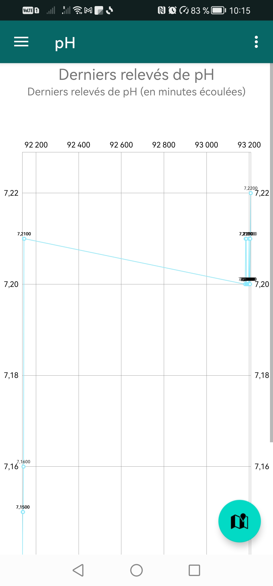

# EcoBoat Project

EcoBoat is an Arduino-based small boat designed to collect environmental data such as temperature, PH value, and Nitrate level. The data collected by the boat is sent to a database via an API and displayed in real-time through a mobile application.

## Components

The EcoBoat project consists of three main components:  

### Arduino Boat: 

The boat is equipped with sensors to measure temperature, PH value, and Nitrate level. The data collected by these sensors is sent to the database via an API. The code for this component is written in Arduino.  

### API: 

The API is responsible for receiving the data from the Arduino boat and storing it in the database. The API is written in Node.js.  

### Mobile Application: 

The mobile application retrieves the data from the database and displays it in real-time. The application is written in Flutter.  

## Setup and Installation

### Arduino Boat

Install the Arduino IDE.
Open the Arduino code file.
Upload the code to your Arduino board.

## API

Install Node.js and npm.
Navigate to the API directory.
Run npm install to install the dependencies.
Run node app.js to start the API.

### Mobile Application

Install Flutter and Dart.
Navigate to the application directory.
Run flutter pub get to install the dependencies.
Run flutter run to start the application.

### License
Non-Profit Open Software License

### EcoBoat

### Application

